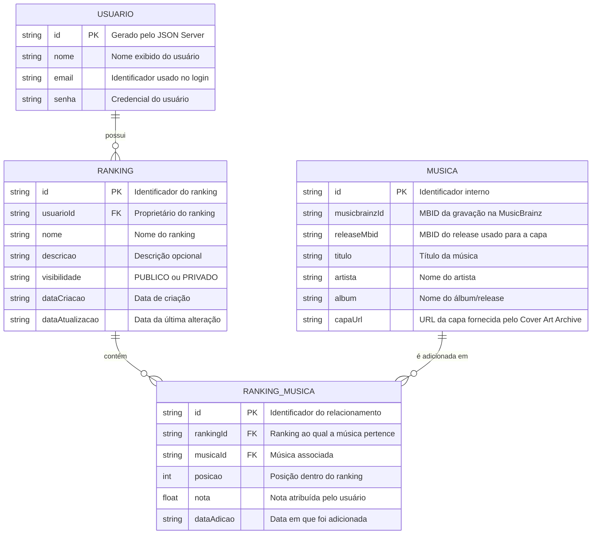

# 🛠️ Especificação de Arquitetura (Architecture Spec) - Rank Your Music

Este documento detalha a arquitetura funcional, o modelo de dados, a estrutura do banco de dados simulado e os contratos de API necessários para o funcionamento do **Rank Your Music**.

O **Rank Your Music** é uma aplicação web para que usuários possam criar e gerenciar rankings personalizados de músicas, organizando-as de acordo com suas próprias preferências. O sistema não é uma plataforma de streaming: seu objetivo principal é permitir que o usuário **organize, classifique e expresse suas preferências musicais**.

A aplicação utiliza o **JSON Server** como API local simulada para os dados próprios do sistema. Para pesquisa e identificação de músicas, as principais APIs externas utilizadas são a **MusicBrainz API** e a **Cover Art Archive API**. A MusicBrainz fornece metadados musicais e identificadores como MBIDs, enquanto o Cover Art Archive fornece as imagens de capa associadas aos releases do MusicBrainz. citeturn360058search0turn462904search1

## 1. Stack Tecnológica e Versões

- **Framework CSS:** Bootstrap v5.3.8.
- **Preprocessador CSS:** Sass/SCSS v1.85.0+.
- **JavaScript:** ES6+ Vanilla JS + jQuery v3.7.1.
- **API Fake Local:** JSON Server.
---

## 1. Modelo de Dados (Diagrama ER)

Abaixo está o Diagrama Entidade-Relacionamento (DER) que representa a estrutura do banco de dados simulado (`db.json`) e como as informações se conectam.



### Relacionamentos principais

- Um **Usuário** pode possuir vários **Rankings**.
- Um **Ranking** pertence a apenas um usuário proprietário.
- Um **Ranking** pode conter várias músicas.
- Uma **Música** pode aparecer em vários rankings diferentes.
- O relacionamento **Ranking_Musica** guarda informações específicas daquela música dentro daquele ranking, principalmente sua **posição** e sua **nota**.
- A combinação `rankingId + musicaId` identifica a associação da música com um ranking.
- `musicbrainzId` identifica a gravação na MusicBrainz.
- `releaseMbid` identifica o release do qual a capa será obtida no Cover Art Archive. A API do Cover Art Archive utiliza o MBID de um release ou release group para localizar as imagens. citeturn462904search1

---

## 2. Dicionário de Dados

### Usuários

Responsável por armazenar os dados necessários para identificação, cadastro e autenticação do usuário.

- **id:** Identificador único do usuário.
- **nome:** Nome exibido na aplicação.
- **email:** Identificador utilizado para login.
- **senha:** Senha cadastrada pelo usuário. Neste projeto acadêmico, o armazenamento pode ser tratado de forma simples, sem pretensão de segurança de produção.

### Rankings

Representa uma lista personalizada criada por um usuário.

- **id:** Identificador único do ranking.
- **usuarioId:** Chave estrangeira que vincula o ranking ao usuário proprietário.
- **nome:** Nome do ranking.
- **descricao:** Texto opcional utilizado para explicar o propósito ou critério do ranking.
- **visibilidade:** Define se o ranking pode ser visualizado publicamente ou somente pelo proprietário.
- **dataCriacao:** Data em que o ranking foi criado.
- **dataAtualizacao:** Data da última alteração relevante do ranking.

Valores utilizados para `visibilidade`:

```text
PUBLICO
PRIVADO
```

### Músicas

Armazena os dados básicos necessários para identificar as músicas obtidas a partir da MusicBrainz e suas respectivas capas no Cover Art Archive.

- **id:** Identificador interno da música dentro da aplicação.
- **musicbrainzId:** MBID da gravação (`recording`) retornado pela MusicBrainz.
- **releaseMbid:** MBID do release escolhido para obter a capa correspondente no Cover Art Archive.
- **titulo:** Título da gravação.
- **artista:** Artista ou grupo associado à gravação.
- **album:** Nome do release/álbum utilizado na exibição da música.
- **capaUrl:** URL da imagem da capa obtida a partir do Cover Art Archive.

A MusicBrainz API oferece recursos de pesquisa e consulta de entidades e retorna dados em JSON quando solicitado com `fmt=json`. A pesquisa de gravações utiliza o recurso `recording`, que permite encontrar músicas por título, artista e outros campos. citeturn360058search0turn360058search5turn360058search6

### Ranking_Musica

Coleção intermediária responsável por relacionar músicas e rankings.

- **id:** Identificador único do relacionamento.
- **rankingId:** Chave estrangeira para o ranking.
- **musicaId:** Chave estrangeira para a música.
- **posicao:** Número inteiro que representa a posição da música no ranking. Quanto menor o número, maior a posição na classificação.
- **nota:** Nota atribuída pelo usuário para representar sua avaliação daquela música no ranking.
- **dataAdicao:** Data em que a música entrou no ranking.

A entidade `rankingMusicas` é necessária porque a mesma música pode ocupar posições diferentes e receber notas diferentes em rankings diferentes.

---

## 3. Rotas da API (JSON Server)

A aplicação utiliza uma API local simulada para armazenar os dados próprios do sistema.

### Usuários

- `GET /usuarios` - Retorna a lista de usuários.
- `GET /usuarios?email={email}` - Consulta usuário pelo e-mail.
- `POST /usuarios` - Cadastra um novo usuário.

### Rankings

- `GET /rankings` - Retorna os rankings cadastrados.
- `GET /rankings?usuarioId={usuarioId}` - Retorna os rankings de um usuário específico.
- `GET /rankings/{id}` - Retorna um ranking específico.
- `POST /rankings` - Cria um novo ranking.
- `PATCH /rankings/{id}` - Atualiza os dados de um ranking.
- `DELETE /rankings/{id}` - Exclui um ranking.

### Músicas

- `GET /musicas` - Retorna músicas já armazenadas localmente.
- `GET /musicas?musicbrainzId={musicbrainzId}` - Consulta uma música pelo MBID da MusicBrainz.
- `POST /musicas` - Cadastra localmente uma música obtida das APIs externas.

### Músicas dos rankings

- `GET /rankingMusicas` - Retorna os relacionamentos entre rankings e músicas.
- `GET /rankingMusicas?rankingId={rankingId}` - Retorna as músicas de um ranking específico.
- `GET /rankingMusicas?rankingId={rankingId}&musicaId={musicaId}` - Verifica se uma música já pertence ao ranking.
- `POST /rankingMusicas` - Adiciona uma música a um ranking.
- `PATCH /rankingMusicas/{id}` - Atualiza posição ou nota de uma música no ranking.
- `DELETE /rankingMusicas/{id}` - Remove uma música do ranking.

---

## 4. APIs Externas Principais

### 4.1 MusicBrainz API

A **MusicBrainz API** é responsável pela pesquisa e identificação das músicas utilizadas pela aplicação. Seu Web Service é acessado pelo endereço base `https://musicbrainz.org/ws/2/` e disponibiliza recursos como `recording`, `artist`, `release` e `release-group`. A API aceita respostas em JSON com `fmt=json`. citeturn360058search0turn360058search2

Para o Rank Your Music, a pesquisa principal será feita em `recording`, pois esse recurso representa as gravações/faixas musicais. O resultado fornece, entre outros dados, o MBID da gravação, título, créditos de artista e referências a releases. citeturn360058search5turn360058search6

#### Endpoint principal de pesquisa

```http
GET https://musicbrainz.org/ws/2/recording/?query={termo}&fmt=json&limit=10
```

Exemplo conceitual:

```text
GET /ws/2/recording/?query=recording:%22Bohemian%20Rhapsody%22&fmt=json&limit=10
```

Campos relevantes para a aplicação:

```text
id                  -> musicbrainzId
 title               -> titulo
artist-credit       -> artista
releases[].id       -> releaseMbid
releases[].title    -> album
```

A aplicação utiliza a busca para preencher a tela `search.html`. Depois da seleção de um resultado, o MBID da gravação e um release relacionado podem ser armazenados localmente.

A documentação oficial também informa que aplicações devem respeitar o limite de requisições do serviço e utilizar um `User-Agent` identificável. Para este projeto, as consultas devem ser feitas de forma controlada, evitando múltiplas chamadas desnecessárias. citeturn360058search0turn360058search1

### 4.2 Cover Art Archive API

A **Cover Art Archive** é utilizada para obter as imagens das capas associadas aos releases cadastrados na MusicBrainz. O serviço trabalha em conjunto com os identificadores MBID da MusicBrainz. citeturn462904search3

A consulta principal para o projeto utiliza o MBID de um release retornado pela MusicBrainz.

#### Endpoint principal da capa

```http
GET https://coverartarchive.org/release/{releaseMbid}/front-500
```

O endpoint `front` retorna a imagem considerada a capa frontal principal do release, e o sufixo `-500` solicita uma miniatura de 500 pixels. A API também disponibiliza tamanhos de 250 e 1200 pixels. citeturn462904search1

#### Consulta de metadados das capas

```http
GET https://coverartarchive.org/release/{releaseMbid}/
```

Essa consulta retorna um JSON com as imagens disponíveis e suas informações, incluindo URLs de imagens e thumbnails. citeturn462904search1

### 4.3 Fluxo combinado das APIs externas

A pesquisa de uma música seguirá este fluxo:

```text
Usuário informa o termo
          |
          v
    MusicBrainz API
          |
          v
 Pesquisa de recording
          |
          +----> título
          +----> artista
          +----> recording MBID
          +----> release MBID
          |
          v
  Cover Art Archive
          |
          v
      capaUrl
          |
          v
 Resultado exibido ao usuário
          |
          v
 Persistência em /musicas
```

Dessa forma, a MusicBrainz é a fonte principal dos metadados musicais e o Cover Art Archive é a fonte principal das imagens de capa.

---

## 5. Estrutura do Banco de Dados (db.json)

Esta é a representação em formato JSON do banco de dados simulado. A estrutura serve como contexto para a aplicação e para a inicialização da API Fake.

```json
{
    "usuarios": [
        {
            "id": "1",
            "nome": "Mateus",
            "email": "mateus@email.com",
            "senha": "senha123"
        }
    ],
    "rankings": [
        {
            "id": "1",
            "usuarioId": "1",
            "nome": "Minhas Favoritas",
            "descricao": "Músicas favoritas sem considerar gênero.",
            "visibilidade": "PUBLICO",
            "dataCriacao": "2026-09-21",
            "dataAtualizacao": "2026-09-21"
        },
        {
            "id": "2",
            "usuarioId": "1",
            "nome": "Eletrônica",
            "descricao": "Ranking pessoal de músicas eletrônicas.",
            "visibilidade": "PRIVADO",
            "dataCriacao": "2026-09-21",
            "dataAtualizacao": "2026-09-21"
        }
    ],
    "musicas": [
        {
            "id": "1",
            "musicbrainzId": "026fa041-3917-4c73-9079-ed16e36f20f8",
            "releaseMbid": "383be31c-37a0-4e08-8cda-cbcbbc587ae5",
            "titulo": "Blow Your Mind (Mwah)",
            "artista": "Dua Lipa",
            "album": "Blow Your Mind (Mwah)",
            "capaUrl": "https://coverartarchive.org/release/383be31c-37a0-4e08-8cda-cbcbbc587ae5/front-500"
        }
    ],
    "rankingMusicas": [
        {
            "id": "1",
            "rankingId": "1",
            "musicaId": "1",
            "posicao": 1,
            "nota": 10.0,
            "dataAdicao": "2026-09-21"
        }
    ]
}
```

O exemplo acima utiliza identificadores apresentados na documentação de exemplo da MusicBrainz para demonstrar a ligação entre uma gravação, um release e a URL de capa correspondente. Em dados reais inseridos pelo sistema, esses valores serão obtidos dinamicamente das APIs externas. citeturn360058search6turn462904search1

---

## 6. Estrutura das Páginas e Responsabilidades

A arquitetura de interface é organizada em quatro páginas principais, suficientes para representar as funcionalidades do PRD e atender ao requisito mínimo de páginas distintas.

### 6.1 `index.html` — Autenticação

Responsável por login e cadastro.

Funcionalidades:

- Login.
- Acesso ao cadastro.
- Cadastro de novo usuário.
- Validação de campos obrigatórios.
- Feedback visual de erro.
- Feedback visual de sucesso.
- Persistência da sessão no Web Storage.

Relacionamento com o PRD:

```text
US01 — Criar Conta
US02 — Realizar Login
US03 — Encerrar Sessão
```

---

### 6.2 `rankings.html` — Meus Rankings

Responsável pela área principal do usuário autenticado.

Funcionalidades:

- Listagem dos rankings do usuário.
- Identificação de rankings públicos e privados.
- Criação de ranking.
- Edição de ranking.
- Exclusão de ranking.
- Modal de confirmação para exclusão.
- Estado vazio quando não existem rankings.

Relacionamento com o PRD:

```text
US04 — Criar Ranking
US05 — Visualizar Meus Rankings
US06 — Editar Ranking
US07 — Excluir Ranking
```

---

### 6.3 `ranking.html` — Detalhes do Ranking

Responsável pela visualização e edição do conteúdo de um ranking específico.

Funcionalidades:

- Título do ranking.
- Visibilidade.
- Lista de músicas.
- Posição de cada música.
- Capa do álbum.
- Nome da música.
- Artista.
- Nota.
- Reordenação por drag-and-drop.
- Remoção de música.
- Acesso à adição de músicas.
- Estado vazio do ranking.

Relacionamento com o PRD:

```text
US09 — Adicionar Música ao Ranking
US10 — Remover Música do Ranking
US11 — Reordenar Músicas
```

---

### 6.4 `search.html` — Pesquisa de Músicas

Responsável por pesquisar músicas por meio das APIs externas.

Funcionalidades:

- Campo de busca.
- Estado inicial.
- Estado de carregamento.
- Exibição de resultados.
- Informações da música.
- Capa obtida pelo Cover Art Archive.
- Ação de adicionar música ao ranking.
- Estado sem resultados.
- Estado de erro.

Relacionamento com o PRD:

```text
US08 — Pesquisar Música
US09 — Adicionar Música ao Ranking
```

---

## 7. Navegação e Fluxo Principal

O fluxo principal da aplicação pode ser representado da seguinte forma:

```text
                    ┌─────────────────────┐
                    │  Login / Cadastro   │
                    │    index.html       │
                    └──────────┬──────────┘
                               │
                         login válido
                               │
                               ▼
                    ┌─────────────────────┐
                    │    Meus Rankings    │
                    │   rankings.html     │
                    └───────┬───────┬─────┘
                            │       │
                      abrir │       │ criar/editar
                            │       │
                            ▼       ▼
                  ┌──────────────┐  ┌───────────────┐
                  │Ranking Detail│  │Ranking Modal  │
                  │ ranking.html │  │/ formulário    │
                  └───────┬──────┘  └───────────────┘
                          │
                     adicionar
                       música
                          │
                          ▼
                  ┌──────────────┐
                  │   Search     │
                  │  search.html │
                  └───────┬──────┘
                          │
                    MusicBrainz
                          │
                          ▼
                  ┌──────────────┐
                  │Cover Art     │
                  │Archive       │
                  └──────────────┘
```

O header compartilhado deve permitir, quando aplicável:

- Voltar para “Meus Rankings”.
- Acessar busca.
- Visualizar usuário autenticado.
- Encerrar sessão.

---

## 8. Web Storage

O Web Storage é utilizado para informações relacionadas ao estado do navegador e à sessão do usuário, enquanto os dados principais do sistema permanecem persistidos na API simulada.

### Dados sugeridos

```text
rankYourMusic_userId
rankYourMusic_userName
rankYourMusic_userEmail
rankYourMusic_currentRankingId
```

### Uso

- `userId`, `userName` e `userEmail` representam a sessão atual.
- `currentRankingId` permite manter o ranking selecionado durante a navegação, quando necessário.
- Ao realizar logout, os dados de sessão devem ser removidos.
- O Web Storage não é a fonte principal dos dados de rankings e músicas.

---

## 9. Contratos de Operação Principais

### Criar ranking

```http
POST /rankings
Content-Type: application/json
```

```json
{
    "usuarioId": "1",
    "nome": "Minhas Favoritas",
    "descricao": "Músicas que mais gosto",
    "visibilidade": "PUBLICO",
    "dataCriacao": "2026-09-21",
    "dataAtualizacao": "2026-09-21"
}
```

### Adicionar música ao ranking

```http
POST /rankingMusicas
Content-Type: application/json
```

```json
{
    "rankingId": "1",
    "musicaId": "2",
    "posicao": 4,
    "nota": 9.5,
    "dataAdicao": "2026-09-21"
}
```

Antes de realizar a operação, o cliente consulta a coleção `rankingMusicas` para verificar se já existe uma associação entre o ranking e a música.

### Atualizar posição

```http
PATCH /rankingMusicas/2
Content-Type: application/json
```

```json
{
    "posicao": 1
}
```

A tela de ranking pode realizar várias atualizações para refletir a nova ordem após uma operação de drag-and-drop.

### Remover música

```http
DELETE /rankingMusicas/2
```

Após a exclusão, a interface deve atualizar as posições exibidas e persistir os novos valores na API local.

### Pesquisar música

```http
GET https://musicbrainz.org/ws/2/recording/?query={termo}&fmt=json&limit=10
```

A aplicação interpreta os dados retornados para montar os resultados da tela de pesquisa.

### Obter capa

```http
GET https://coverartarchive.org/release/{releaseMbid}/front-500
```

A URL pode ser utilizada diretamente como `src` da imagem ou armazenada no campo `capaUrl` da coleção `musicas`. O serviço do Cover Art Archive retorna/encaminha para a imagem associada ao release. citeturn462904search1

---

## 10. Estados de Interface Necessários

O protótipo e a implementação devem contemplar os principais estados funcionais da aplicação.

### Autenticação

- Formulário padrão.
- Campo inválido.
- Credenciais inválidas.
- Cadastro realizado com sucesso.
- Login realizado com sucesso.

### Meus Rankings

- Lista com rankings.
- Ranking público.
- Ranking privado.
- Formulário de criação.
- Formulário de edição.
- Modal de confirmação de exclusão.
- Lista vazia.

### Ranking Detail

- Ranking com músicas.
- Ranking vazio.
- Música selecionada/hover.
- Música sendo arrastada.
- Confirmação de remoção.
- Música adicionada com sucesso.

### Pesquisa

- Estado inicial.
- Carregando.
- Resultados encontrados.
- Nenhum resultado.
- Erro de pesquisa.
- Música adicionada ao ranking.
- Capa indisponível.

---

## 11. Mapeamento do PRD para a Arquitetura

| História de Usuário | Implementação principal |
|---|---|
| US01 — Criar Conta | `index.html` + `POST /usuarios` |
| US02 — Realizar Login | `index.html` + consulta de usuários + Web Storage |
| US03 — Encerrar Sessão | Header + remoção da sessão do Web Storage |
| US04 — Criar Ranking | `rankings.html` + `POST /rankings` |
| US05 — Visualizar Meus Rankings | `rankings.html` + `GET /rankings?usuarioId=...` |
| US06 — Editar Ranking | `rankings.html` + `PATCH /rankings/{id}` |
| US07 — Excluir Ranking | `rankings.html` + modal + `DELETE /rankings/{id}` |
| US08 — Pesquisar Música | `search.html` + MusicBrainz API + Cover Art Archive API |
| US09 — Adicionar Música ao Ranking | `search.html` + `POST /rankingMusicas` |
| US10 — Remover Música do Ranking | `ranking.html` + `DELETE /rankingMusicas/{id}` |
| US11 — Reordenar Músicas | `ranking.html` + drag-and-drop + `PATCH /rankingMusicas/{id}` |

---

## 12. Requisitos de Interface Relacionados à Arquitetura

A identidade visual definida para o projeto deve permanecer consistente entre as páginas.

### Cores principais

```text
Azul-petróleo / principal: #3F6B6B
Background:                #F5F3EE
Verde-sálvia:              #A8C3B0
Branco-lírio:              #FFFFFF
Vermelho-coral:            #C76B67
```

### Tipografia

```text
Inter

H1 — Inter Bold
H2 — Inter SemiBold
H3 — Inter Medium
P  — Inter Regular
A  — Inter Medium
```

### Componentes de interface

A implementação deve utilizar componentes do framework CSS escolhido, mantendo a identidade visual definida no protótipo.

Componentes principais:

- Navbar/Header.
- Botões.
- Cards de ranking.
- Linhas de música.
- Formulários.
- Badges de público/privado.
- Modal de confirmação.
- Alertas de sucesso/erro.
- Indicadores de carregamento.

O componente visual mais importante da aplicação é a **linha de música (`Song Row`)**, pois ela concentra as informações essenciais do ranking: posição, capa, título, artista, nota e ações.

---

## Referências oficiais das APIs

- [MusicBrainz API](https://musicbrainz.org/doc/MusicBrainz_API)
- [MusicBrainz API — Search](https://musicbrainz.org/doc/MusicBrainz_API/Search)
- [MusicBrainz API — Recording Search](https://musicbrainz.org/doc/MusicBrainz_API/Search/RecordingSearch)
- [Cover Art Archive API](https://musicbrainz.org/doc/Cover_Art_Archive/API)
