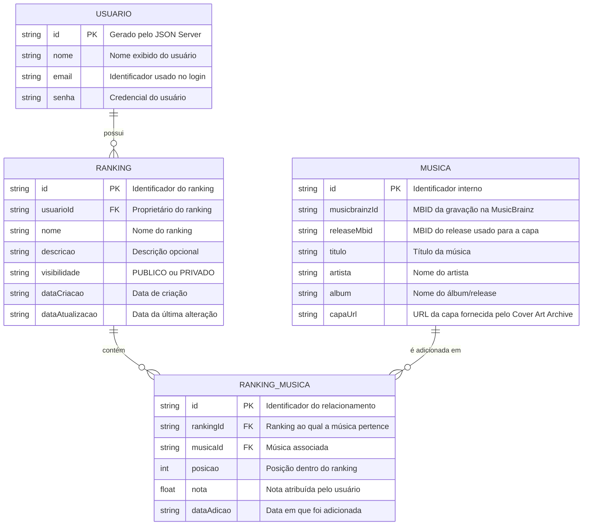

# 🛠️ Especificação de Arquitetura (Architecture Spec) - Rank Your Music

Este documento detalha a arquitetura funcional, o modelo de dados, a estrutura do banco de dados simulado e os contratos de API necessários para o funcionamento do **Rank Your Music**.

O **Rank Your Music** é uma aplicação web para que usuários possam criar e gerenciar rankings personalizados de músicas, organizando-as de acordo com suas próprias preferências. O sistema não é uma plataforma de streaming: seu objetivo principal é permitir que o usuário **organize, classifique e expresse suas preferências musicais**.

A aplicação utiliza o **JSON Server** como API local simulada para os dados próprios do sistema. Para pesquisa e identificação de músicas, as principais APIs externas utilizadas são a **MusicBrainz API** e a **Cover Art Archive API**. A MusicBrainz fornece metadados musicais e identificadores como MBIDs, enquanto o Cover Art Archive fornece as imagens de capa associadas aos releases do MusicBrainz.

## 1. Stack Tecnológica e Versões

- **Framework CSS:** Bootstrap v5.3.8.
- **Preprocessador CSS:** Sass/SCSS v1.85.0+.
- **JavaScript:** ES6+ Vanilla JS + jQuery v3.7.1.
- **API Fake Local:** JSON Server.
---

## 2. Modelo de Dados (Diagrama ER)

Abaixo está o Diagrama Entidade-Relacionamento (DER) que representa a estrutura do banco de dados simulado (`db.json`) e como as informações se conectam.



### Relacionamentos principais

- Um **Usuário** pode possuir vários **Rankings**.
- Um **Ranking** pertence a apenas um usuário proprietário.
- Um **Ranking** pode conter várias músicas.
- Uma **Música** pode aparecer em vários rankings diferentes.
- O relacionamento **Ranking_Musica** guarda informações específicas daquela música dentro daquele ranking, principalmente sua **posição** e sua **nota**.
- A combinação `rankingId + musicaId` identifica a associação da música com um ranking.
- `musicbrainzId` identifica a gravação na MusicBrainz.
- `releaseMbid` identifica o release do qual a capa será obtida no Cover Art Archive. A API do Cover Art Archive utiliza o MBID de um release ou release group para localizar as imagens.

---

## 3. Dicionário de Dados

### Usuários

Responsável por armazenar os dados necessários para identificação, cadastro e autenticação do usuário.

- **id:** Identificador único do usuário.
- **nome:** Nome exibido na aplicação.
- **email:** Identificador utilizado para login.
- **senha:** Senha cadastrada pelo usuário. Neste projeto acadêmico, o armazenamento pode ser tratado de forma simples, sem pretensão de segurança de produção.

### Rankings

Representa uma lista personalizada criada por um usuário.

- **id:** Identificador único do ranking.
- **usuarioId:** Chave estrangeira que vincula o ranking ao usuário proprietário.
- **nome:** Nome do ranking.
- **descricao:** Texto opcional utilizado para explicar o propósito ou critério do ranking.
- **visibilidade:** Define se o ranking pode ser visualizado publicamente ou somente pelo proprietário.
- **dataCriacao:** Data em que o ranking foi criado.
- **dataAtualizacao:** Data da última alteração relevante do ranking.

Valores utilizados para `visibilidade`:

```text
PUBLICO
PRIVADO
```

### Músicas

Armazena os dados básicos necessários para identificar as músicas obtidas a partir da MusicBrainz e suas respectivas capas no Cover Art Archive.

- **id:** Identificador interno da música dentro da aplicação.
- **musicbrainzId:** MBID da gravação (`recording`) retornado pela MusicBrainz.
- **releaseMbid:** MBID do release escolhido para obter a capa correspondente no Cover Art Archive.
- **titulo:** Título da gravação.
- **artista:** Artista ou grupo associado à gravação.
- **album:** Nome do release/álbum utilizado na exibição da música.
- **capaUrl:** URL da imagem da capa obtida a partir do Cover Art Archive.

A MusicBrainz API oferece recursos de pesquisa e consulta de entidades e retorna dados em JSON quando solicitado com `fmt=json`. A pesquisa de gravações utiliza o recurso `recording`, que permite encontrar músicas por título, artista e outros campos.

### Ranking_Musica

Coleção intermediária responsável por relacionar músicas e rankings.
- **id:** Identificador único do relacionamento.
- **rankingId:** Chave estrangeira para o ranking.
- **musicaId:** Chave estrangeira para a música.
- **posicao:** Número inteiro que representa a posição da música no ranking. Quanto menor o número, maior a posição na classificação.
- **nota:** Nota atribuída pelo usuário para representar sua avaliação daquela música no ranking.
- **dataAdicao:** Data em que a música entrou no ranking.

A entidade `rankingMusicas` é necessária porque a mesma música pode ocupar posições diferentes e receber notas diferentes em rankings diferentes.

---

## 4. Rotas da API (JSON Server)

A aplicação utiliza uma API local simulada para armazenar os dados próprios do sistema.

### Usuários

- `GET /usuarios` - Retorna a lista de usuários.
- `GET /usuarios?email={email}` - Consulta usuário pelo e-mail.
- `POST /usuarios` - Cadastra um novo usuário.

### Rankings

- `GET /rankings` - Retorna os rankings cadastrados.
- `GET /rankings?usuarioId={usuarioId}` - Retorna os rankings de um usuário específico.
- `GET /rankings/{id}` - Retorna um ranking específico.
- `POST /rankings` - Cria um novo ranking.
- `PATCH /rankings/{id}` - Atualiza os dados de um ranking.
- `DELETE /rankings/{id}` - Exclui um ranking.

### Músicas

- `GET /musicas` - Retorna músicas já armazenadas localmente.
- `GET /musicas?musicbrainzId={musicbrainzId}` - Consulta uma música pelo MBID da MusicBrainz.
- `POST /musicas` - Cadastra localmente uma música obtida das APIs externas.

### Músicas dos rankings

- `GET /rankingMusicas` - Retorna os relacionamentos entre rankings e músicas.
- `GET /rankingMusicas?rankingId={rankingId}` - Retorna as músicas de um ranking específico.
- `GET /rankingMusicas?rankingId={rankingId}&musicaId={musicaId}` - Verifica se uma música já pertence ao ranking.
- `POST /rankingMusicas` - Adiciona uma música a um ranking.
- `PATCH /rankingMusicas/{id}` - Atualiza posição ou nota de uma música no ranking.
- `DELETE /rankingMusicas/{id}` - Remove uma música do ranking.

---


## 5. Estrutura do Banco de Dados (db.json)

Esta é a representação em formato JSON do banco de dados simulado. A estrutura serve como contexto para a aplicação e para a inicialização da API Fake.

```json
{
    "usuarios": [
        {
            "id": "1",
            "nome": "Mateus",
            "email": "mateus@email.com",
            "senha": "senha123"
        }
    ],
    "rankings": [
        {
            "id": "1",
            "usuarioId": "1",
            "nome": "Minhas Favoritas",
            "descricao": "Músicas favoritas sem considerar gênero.",
            "visibilidade": "PUBLICO",
            "dataCriacao": "2026-09-21",
            "dataAtualizacao": "2026-09-21"
        },
        {
            "id": "2",
            "usuarioId": "1",
            "nome": "Eletrônica",
            "descricao": "Ranking pessoal de músicas eletrônicas.",
            "visibilidade": "PRIVADO",
            "dataCriacao": "2026-09-21",
            "dataAtualizacao": "2026-09-21"
        }
    ],
    "musicas": [
        {
            "id": "1",
            "musicbrainzId": "026fa041-3917-4c73-9079-ed16e36f20f8",
            "releaseMbid": "383be31c-37a0-4e08-8cda-cbcbbc587ae5",
            "titulo": "Blow Your Mind (Mwah)",
            "artista": "Dua Lipa",
            "album": "Blow Your Mind (Mwah)",
            "capaUrl": "https://coverartarchive.org/release/383be31c-37a0-4e08-8cda-cbcbbc587ae5/front-500"
        }
    ],
    "rankingMusicas": [
        {
            "id": "1",
            "rankingId": "1",
            "musicaId": "1",
            "posicao": 1,
            "nota": 10.0,
            "dataAdicao": "2026-09-21"
        }
    ]
}
```

O exemplo acima utiliza identificadores apresentados na documentação de exemplo da MusicBrainz para demonstrar a ligação entre uma gravação, um release e a URL de capa correspondente. Em dados reais inseridos pelo sistema, esses valores serão obtidos dinamicamente das APIs externas. 

---

## Referências oficiais das APIs

- [MusicBrainz API](https://musicbrainz.org/doc/MusicBrainz_API)
- [MusicBrainz API — Search](https://musicbrainz.org/doc/MusicBrainz_API/Search)
- [MusicBrainz API — Recording Search](https://musicbrainz.org/doc/MusicBrainz_API/Search/RecordingSearch)
- [Cover Art Archive API](https://musicbrainz.org/doc/Cover_Art_Archive/API)
